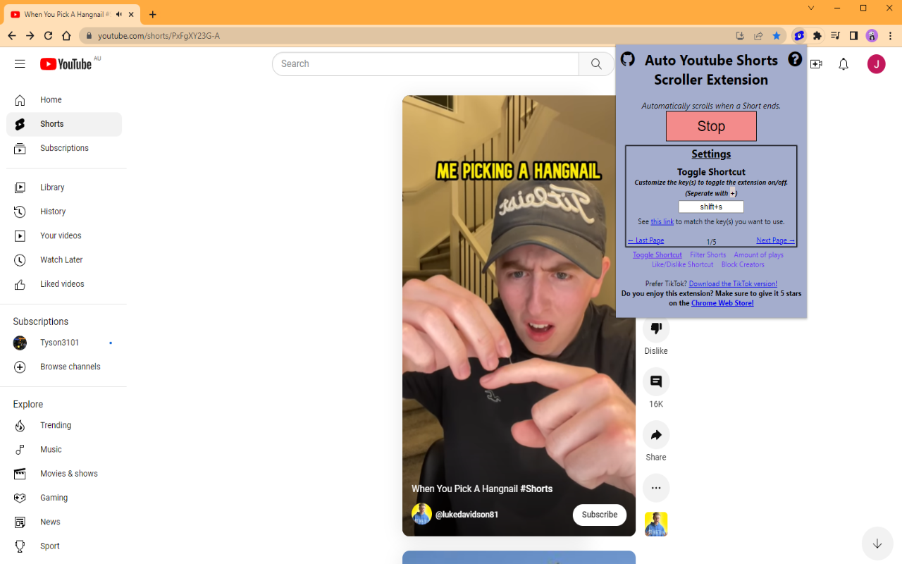

# [Auto-Youtube-Shorts-Scroller](https://github.com/Tyson3101/Auto-Youtube-Shorts-Scroller)

#### DOWNLOAD LATEST VERSION : [https://chromewebstore.google.com/detail/auto-youtube-shorts-scrol/ckbnikemebopgknkpgjlkbffpkkhblbe](https://chromewebstore.google.com/detail/auto-youtube-shorts-scrol/ckbnikemebopgknkpgjlkbffpkkhblbe)

## A Chrome Extension/Bookmarklet that adds an auto-scroll feature on Youtube so you can watch Shorts without the need to touch your mouse.

#### Whenever a YT Short ends, the extension will automatically scroll to the next one for you. Great for doing homework and watching Shorts at the same time without the need to switch tabs!

- Chrome Extension: [Click here](./README.md#chrome-extension)

- Firefox Add-On: [Click here](./README.md#firefox-add-on)

- Bookmarklet: [Click here](./README.md#bookmarklet)

## Chrome Extension

**Option 1** – Install it from the [Chrome Web Store](https://chrome.google.com/webstore/detail/ckbnikemebopgknkpgjlkbffpkkhblbe)

**Option 2** – Install it from source:

- Clone/download this repo,
- Open Chrome and go to `chrome://extensions`,
- Enable "Developer mode",
- Click "Load unpacked extension",
- Select the `extension` folder from this repo.

## Firefox Add-On

For Firefox, you can find a fork of this extension by [SoRadGaming](https://github.com/SoRadGaming).  
The download for the ported add-on can be found [on their repository.](https://github.com/SoRadGaming/Auto-Youtube-Shorts-Scroller)

## Bookmarklet

**Go to this link and save the shown link to your bookmarks (Drag to your bookmark bar)**

Link: [https://tyson3101.github.io/Auto-Youtube-Shorts-Scroller/bookmarklet/bookmarklet.html](https://tyson3101.github.io/Auto-Youtube-Shorts-Scroller/bookmarklet/bookmarklet.html)

##### If you have any suggestions or experience problems, post an issue on the GitHub page: [https://github.com/Tyson3101/Auto-Youtube-Shorts-Scroller/issues](https://github.com/Tyson3101/Auto-Youtube-Shorts-Scroller/issues)

Screenshot of Original Extension | [Chrome Stats](https://chrome-stats.com/d/elggcfikfbaijgcofcapgeahjaclpfnf)

###### Created by Tyson3101
